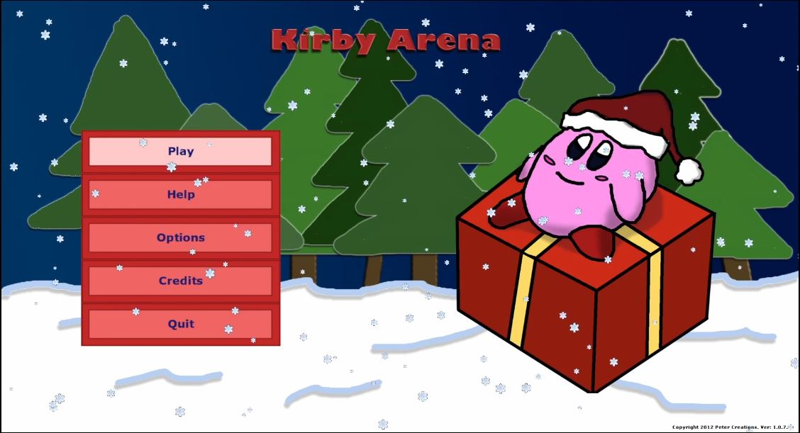
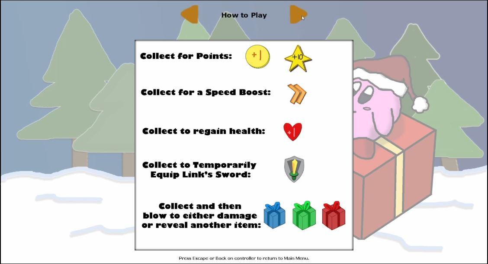
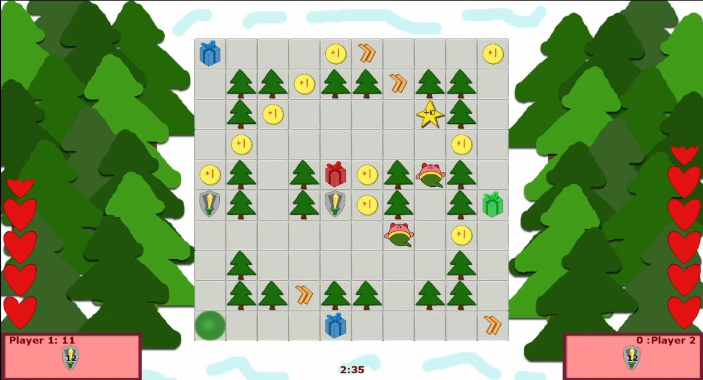
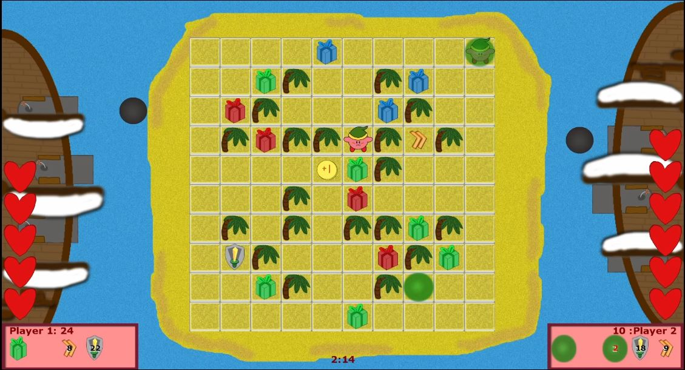
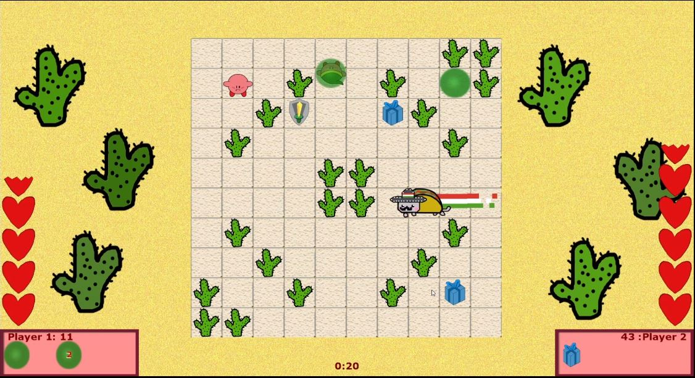
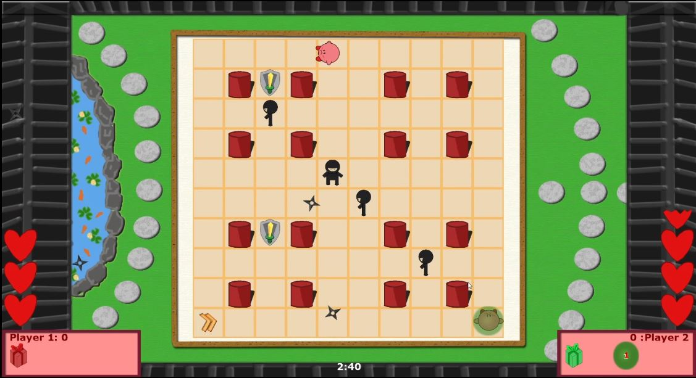

# Kirby Arena

Developed by Peter Mitchell

- ([Youtube Demo](https://youtu.be/oxCJZz_r7_4))

# Running and Compiling

To run the game you may need to install the XNA redistributable: https://www.microsoft.com/en-au/download/details.aspx?id=20914

If you want to compile the game yourself you will need the XNA SDK: https://www.microsoft.com/en-au/download/details.aspx?id=23714

# Images from the Game

The following images are a collection representing the game content.

